# flutter_gamepads

A Flutter package that maps gamepad input to UI interaction. It is built on Flutter’s focus
and intent system which powers keyboard navigation in Flutter.

This means that for a large part, the same effort you spend on supporting keyboard and
screen reader users also benefit gamepad users and vice versa.

The philosophy is that you just add Gamepad support to your app to extend its multi-modality
of user input.


## Features


### Input support

- Gamepad buttons and axes can be used as input
- Input repetition (on long press/activation)
- Uses [gamepads](https://pub.dev/packages/gamepads) as the underlying Gamepad platforms
  support library


### Output support

- Move focus
- Activate focused button
- Dismiss
- Scroll
- (actually anything that you can do with Intents in Flutter, plus more with callbacks)


### API and docs

- A GamepadControl widget to wrap your app which in some cases is all you need.
- Callbacks that allow intercepting an Intent before it actually is emitted.
- Extensive example project showing how the package can be used in pure Flutter apps
  as well as for Flame game overlays.

Can be used in both pure Flutter apps and in Flame games for overlays and menus. For Flame
usage, see the Flame-specific guidance later in the README.


## Not included

This package does not magically "just work" in all cases. Your app has to work reasonably well
with the Flutter focus system and there can be some widgets that need some extra work to get
working.

Text input is currently not supported via Gamepad input.

If you just want to add gamepad support as game input without any UI navigation, you are probably
better off using the [gamepads](https://pub.dev/packages/gamepads) package directly.


## Quick-start


### Preparation

Use only TAB key and Space/Enter to navigate your app. If this works, it will likely work well
with gamepad input.

If there are widgets you cannot reach, fix that first. If there are widgets you cannot interact
with while they are focused, that can be handled specifically for gamepads.

If you cannot clearly see which widget has focus, update the theme of your app and make for
example the border of focused widgets stand out in a different color.


### Gamepad support

1. Start by wrapping your MaterialApp with `GamepadControl`, which in some cases is all you need.
2. Test your app
3. If you find out that some widgets can't be controlled with a gamepad, add an `onBeforeIntent`
   callback to `GamepadControl` or wrap each widget with a `GamepadInterceptor`. See below for
   detailed explanation of callbacks.


## How it works


### GamepadControl

This widget will listen to `gamepads` normalized input events and emit Intents originating
from the primary focused widget.

By default GamepadControl comes with these bindings:

- D-pad up: Previous focus
- D-pad left: Previous focus
- D-pad right: Next focus
- D-pad down: Next focus
- A: Activate
- B: Dismiss
- Right stick up: Scroll up
- Right stick left: Scroll left
- Right stick right: Scroll right
- Right stick down: Scroll down

But they can be customized via the `shortcuts` parameter. It is not limited to the intents
above. Any class that inherits from the `Intent` base class can be used as the emitted intent
for a gamepad activator (button or axis).


#### Multiple GamepadControl widgets

Note that if you have multiple `GamepadControl` widgets concurrently in your widget tree, they
will all emit intents on the `primaryFocus` focus node. Except if you set `ignoreEvents` or
use `onBeforeIntent` to block intents from all but one of the `GamepadControl` widgets.

The `GamepadControl` widget does not check if primaryFocus is a descendant of itself.


### Callbacks and the emit chain

The chain from received `NormalizedGamepadEvent` from `gamepads` package via callbacks to
emitting an intent is described by the diagram below.



If no GamepadInterceptor is found, or if GamepadControl.onBeforeIntent is not set, execution
continues as if true was returned.


### GamepadInterceptor

If you want to intercept a Gamepad intent locally next to a Widget you can do so with
`GamepadInterceptor`. Its `onBeforeIntent` is only called if a descendant widget has focus.

```dart
GamepadInterceptor(
    onBeforeIntent: (activator, intent) {
        if (intent is ScrollIntent) {
            // Handle scroll intent
            print('Gamepad scroll ${intent.direction}');

            // Block actual emit of ScrollIntent
            return false;
        }
        // Allow other intents such as focus change to occur
        return true;
    }
    child: YourWidget(),
)
```

An example of how to build a gamepad extended widget can be found in
[SliderWithGamepadExport](https://github.com/flame-engine/gamepads/tree/main/packages/flutter_example/example/lib/flutter_example/pages/slider_with_gamepad_support.dart).


### Blocking Gamepad input

There are four ways to block gamepad input from invoking intents:

1. Omitting the `GamepadControl` widget from your widget tree

  - Fully unregisters `gamepad` event handles, axis activation memory, repeat timers etc.

2. `GamepadControl.ignoreEvents == true`

  - Early check on each `gamepads` event, axis activation memory is reset and repeat timers are
    reset.

3. `GamepadInterceptor.onBeforeIntent() => false`

  - Blocks each intent before it is passed on to GamepadControl.onBeforeIntent()

4. `GamepadControl.onBeforeIntent() => false`

  - Blocks each intent before it is passed on to Flutter.

Method 1 and 2 are good for when you fully want to block gamepad control of Flutter UI.

Method 3 or 4 is good if you want to block specific intents.


## Flame specific guidance

`flutter_gamepads` can be helpful in scenarios when you have overlays in your
Flame game that you want users to be able to navigate with their gamepad.

1. Wrap your `GameWidget` with a `GamepadControl` widget
2. For overlays that represent a modal dialog, you will need to trap the focus
   in the dialog. See
   [OverlayDialogBackdrop](https://github.com/flame-engine/gamepads/tree/main/packages/flutter_example/example/lib/flame_example/overlays/overlay_dialog_backdrop.dart)
   in Flame example app for how you can do that. In that example the dialog itself
   will receive the focus so that when a mouse user opens the dialog, it won't show
   a focus indicator on a button in the dialog.
3. To close overlay dialogs on DismissIntent, you will need to catch it with
   `onBeforeIntent` and close the overlay. In
   [Flame Example](https://github.com/flame-engine/gamepads/tree/main/packages/flutter_example/example/lib/flame_example/main.dart)
   this is done generically at the root, but could instead wrap each dialog in a
   `GamepadInterceptor` to do it locally if you need to guard closing the dialog
   by some condition.
4. If you need to disable `GamepadControl` while in-game you can do so by setting
   `ignoreEvents = true` on it.


## Code example

In the example folder there is both a full Flutter app and a full Flame game example showing
how the package can be used in those two scenarios.

Here follows a brief code example:

```dart
GamepadControl(
    child: MaterialApp(
        home: Scaffold(
            body: Column(
                children: [
                    SwitchListTile(
                        title: const Text('Works with gamepads'),
                        value: switchValue,
                        onChanged: (value) => setState(() => switchValue = value),
                    ),
                    ElevatedButton(onPressed: () {}, Text('Can be clicked with gamepad')),
                    // This can be focused, but gamepad users cannot change the value
                    // The solution is given below.
                    Slider(
                        value: sliderValue,
                        label: 'Does not work with gamepads',
                        onChange: (value) => setState(() => sliderValue = value),
                    ),
                    // This slider can be operated with Gamepad due to the compatibility
                    // layer provided via GamepadInterceptor.
                    GamepadInterceptor(
                        onBeforeIntent: (activator, intent) {
                            if (intent is ScrollIntent) {
                                if (intent.direction == AxisDirection.right) {
                                    setState(() _value = min(1.0, _value + 0.1));
                                } else if (intent.direction == AxisDirection.left) {
                                    setState(() _value = max(0.0, _value - 0.1));
                                }
                                // Block actual emit of ScrollIntent
                                return false;
                            }
                            // Allow other intents such as focus change to occur
                            return true;
                        },
                        child: Slider(
                            value: _value,
                            label: 'Works with gamepads',
                            max: 1.0,
                            // This setState never occur by Gamepad input, but is good to allow
                            // keyboard/mouse input as well.
                            onChange: (value) => setState(() => _value = value),
                        ),
                    ),
                ],
            ),
        ),
    ),
)
```
